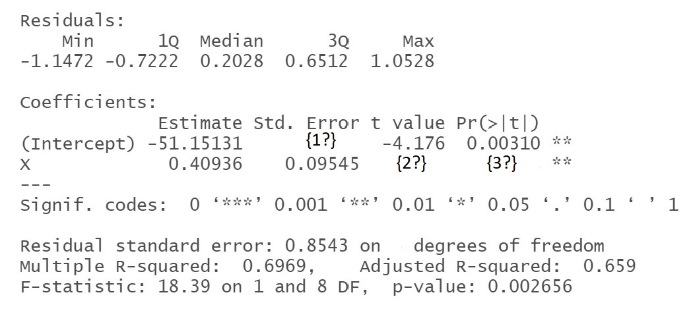

# 2$^{nd}$ Tutorial

## Recap
Previously we discussed the least squared approach to estimate the slope and the bias parameters in the simple linear model. An important question arises here is to test how significant is our estimation and in order to assess that let us assume the error term is normally distributed with zero mean and constant variance $\sigma^2$. We want to test $H_0 : \beta_j = \hat{\beta}~~~ \text{vs.}~ ~~H_1 : \beta_{j}= \hat{\beta}$ at level $\alpha$ where $\hat{\beta}$  is some constant and $j=0,1$.
\
The  **decision** rule is to reject $H_0$ if:
$$|T|=\lvert~\frac{\beta_j-{\hat\beta}}{SE(\hat\beta_j)}\lvert~> t_{n-2,\alpha/2}$$
Where $SE()$ is the standard error of the parameter.
Recall that from the lecture note:
\begin{align}
 &Var(\beta_1)=\frac{\sigma^2}{(n-1)S_{X'X'}} = \frac{\sigma^2}{\sum (x_i-\bar{x})2}\\
 &Var(\beta_0)= \sigma^2 (\frac{1}{n}+\frac{\bar{x}^2}{\sum (x_i-\bar{x})2})

\end{align}

## Exercises
::: {.exercise}
Go back to **Exercise 1.3** and test the hypothesis that the yield is proportional to the amount of catalyst cubed.
:::
\

\
**Solution 2.1:**
\
Now $Var(\beta)=\frac{\sigma^2}{(n-1)S_{X'X'}}$
$$(n-1)S_{X'X'}=\sum_{i=1}^{n}x'^2_i-\frac{(\sum_{i=1}^{n}x'_i)^2}{n}=0.33$$
While $\sigma^2$ can be estimated by using the unbiased estimator $s^2$,

$$s^2=\frac{1}{2}\sum_{i=1}^{n}(y'_i-\hat{y'_i})^2=0.0018$$

Hence $SE(\beta)=\sqrt{Var(\hat\beta)}= 0.0739$.
Now to test $H_0: \beta=3$ against $H_q: \beta\neq3$
Under $H_0$, the T-test is $-0.0932$
\
So the p-value is $P(|t4| > 0.0932) = 2P(t4 < −0.0932) = 0.9302$. There is therefore no evidence to reject $H_0$ i.e. no evidence against a cubic relationship.

**Exercise 2.2:**
The results of a class of 10 students on midterm marks $X$ and on the final marks $Y$ are as follows:

```{r , echo=FALSE}
frame = data.frame(X=c(77,54,71,72,81,94,96,99,83,67),Y=c(82,38,78,34,37,85,99,99,79,67))
frame=t(frame)

knitr::kable(frame, raw.names = c("X","Y"), align = "lccrr")
```
1. Calculate the regression line by hand.
2. interpret the result.
3. Construct $95\%$ confidence intervals for the bias and the weight coefficients.
4. Use the `lm()` function in R to calculate regression line.
5. Use the `confint()` in R to construct $95\%$ confidence intervals for the model coefficients.
6. plot the regression line using the function `plot()`. 
7. If a student got in his midterm $50$ what the expected mark in his final exam?


**Solution 2.2:**
Now we can estimate the regression parameters using the least square approach so, 
\begin{align}
&\hat{\beta_1} = \frac{\sum(y-\bar{y})(x-\bar{x})}{\sum(x-\bar{x})^2} = \frac{2268.8}{ 1818.4}= 1.24769 \\
&\hat{\beta_0}=\bar{y}-\beta_1~\bar{x} = -29.26659

\end{align}

the interpretation of the coefficients is that the model expect that the final mark is increase by $1.25$ when the midterm mark increase by ONE while $\beta_0$ is the y-axis intercept. 

To construct a $95\%$ confidence interval we know that $$
|T|=\lvert~\frac{\beta_j-{\hat\beta}}{SE(\hat\beta_j)}\lvert \sim t_{n-2}$$
It follows that a $100(1 − α)%$ confidence interval for $\beta_j$ is
$$\hat{\beta_j} \pm SE(\hat\beta)\times~t_{n-2,\alpha/2}$$
So as 

\begin{align}
&\sigma^2 = \frac{1}{n-2}~\sum~(y_i-\hat{y})^2 = \frac{1}{8}~\sum (y_i-(1.24769~x_i−29.26659))^2 = 347.855\\

&SE(\hat\beta_1) =\sqrt{\frac{\sigma^2}{\sum{(x_i-\bar{x})^2}}} = \sqrt{\frac{347.855}{1818.4}}=\sqrt{0.1912973}=0.4373755\\
&SE(\hat{\beta_0})=\sqrt{\sigma^2~(\frac{1}{n}+\frac{\bar{x}}{\sum{(x_i-\bar{x})^2}})}= \sqrt{347.855(\frac{1}{8}+\frac{6304.36}{1818.4})} = 35.34811
\end{align}

Therefore, the $95\%$ confidence intervals for $\beta_0$ and $\beta_1$ are:
\begin{align}
\beta_0 &\in (-110.495,51.9621)\\
\beta_1 &\in (0.239,2.256)
\end{align}

In R we can use the build-in function `lm()` as follow:
```{r}
X=c(77,54,71,72,81,94,96,99,83,67)
Y=c(82,38,78,34,37,85,99,99,79,67)
fit <- lm(Y~X)
summary(fit) 
```
Then `confint()` can be used to find $95\%$ confidence interval as follow:
```{r}
confint(fit)
```

```{r}
plot(X,Y)
abline(fit)
```

To predict the final mark for the student whom midterm mark $55$
```{r}
predict(fit,newdata = data.frame(X=c(55)))
```

## Coursework

In the following R output 3 values denoted {i?} for $i = 1,2$ and $3$ have been removed. What are the $3$ missing values?
\
\
```{r, echo=FALSE}

```

