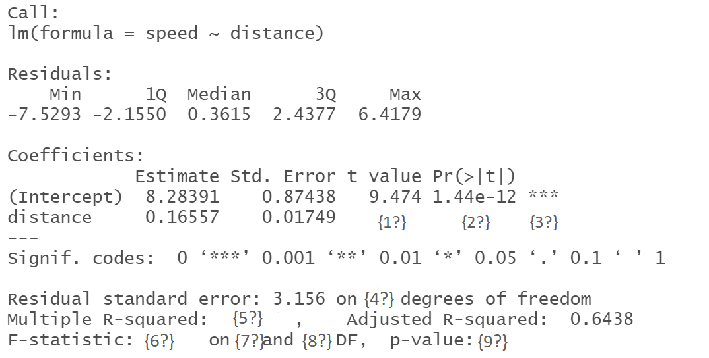

# 3rd Tutorial

## Recap

We want to test $H_0:\beta_0 = \beta_1 = 0$ vs. $H_1 :\beta_1~~ \text{or} ~~\beta_0 \neq 0$ at level $\alpha$.
Note that if we reject $H_0$ we are saying that the model $\hat{\beta}_0 +\hat{\beta_1}X$  has some ability to explain the variance that we are observing in Y . (i.e. There exists a linear relationship between the explanatory variables and the response variable.) Recall that ANOVA table can be used in the test for the existence of regression which is 

Source of Variation    SS       df        MS        F
-------------------- ------ ----------  -------   ------- 
     Regression        SSR      1         MSR     $F_0=\frac{MSR}{MSE}$
       Error           SSE     n-2        MSE
       Total           SSTO    n-1


Where, 
\begin{align}
SSR &= \sum~(\hat{y}_{i}-\bar{y})^2\\
SSE &= \sum~(\hat{y_i}-y_i)^2\\
SSTO&= \sum~(y_i-\bar{y})^2\\
MSR &= \frac{SSR}{1}\\
MSE &= \frac{SSE}{n-2}
\end{align}


To assess how well the regression line fit the data one can use the **The coefficient of determination ** $R^2$  which can be defined as follow:

$$R^2=\frac{SSR}{SSTO}=1-~\frac{SSE}{SSTO}$$ 

which measures the proportion of variability explained by the regression.

## Exercieses
1.  In the following R output 9 values denoted {i?} for $i = 1,2$ ,..., $9$ have been removed. What are the $9$ missing values? **Note:** there are 50 observations are used to draw this model. 
\
\
```{r, echo=FALSE}

```

2. interpret $R^2$ in the previous Exercise. 
3. Draw a conclusion about the existence of the regression. 


\
\
\
\
\
\
\
\
\
\
\
\
\
\
\
\
\
\
\
\
\
\
\
\
\
\
2. A second-hand cars dealer has 10 cars for sale. He decides to investigate the relation between the cars age $X$ (in years) and the millage $Y$ (in thousands miles) by using the simple linear regression model. The dealer reported the following: The mean and standard deviation of the cars millage are given, respectively, by $40.6$ and $11.87153$. The correlation coefficient between $X$ and $Y$ is $0.9687105$. The estimated simple regression model is $\hat{Y} = 8.892 + 7.733X$.
where

$$𝑛 = 10 ~~~~~~~~~~ \bar{Y} = 40.6 ~~~~~~~~~~ S_Y = 11.87153 $$

a) Obtain $S_{YY} , S_{XX}$ and $S_{XY}$
b) Construct $90\%$ CI for the slope
c) Compute the $95\%$ CI for car millage with age $7$ years.
d) Use ANOVA for testing the significance of the linearity.
e) What proportion of the total variation in millage is explained by age?
\
\
\
\
\
\
\
\
\
\
\
\
\
\
\
\
\
\
\
\
\
\
\
\
\
## Coursework

